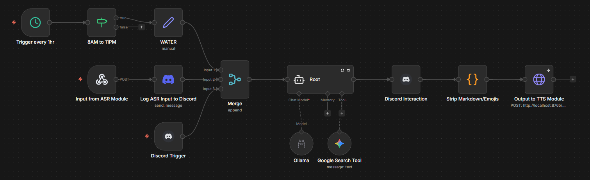

```
███████╗██████╗ ██╗██████╗  █████╗ ██╗   ██╗
██╔════╝██╔══██╗██║██╔══██╗██╔══██╗╚██╗ ██╔╝
█████╗  ██████╔╝██║██║  ██║███████║ ╚████╔╝
██╔══╝  ██╔══██╗██║██║  ██║██╔══██║  ╚██╔╝
██║     ██║  ██║██║██████╔╝██║  ██║   ██║
╚═╝     ╚═╝  ╚═╝╚═╝╚═════╝ ╚═╝  ╚═╝   ╚═╝
```

### Voice AI assistant for Discord

---

## Pipeline

```
Discord voice → VAD (Silero) → ASR (Parakeet TDT 0.6B) → n8n webhook → TTS (Kokoro 82M) → Discord voice
```

Friday is a **hands-free** voice assistant — it automatically joins whatever Discord voice channel you're in, listens for your speech, transcribes it, sends it to an n8n workflow for LLM processing, and speaks the response back. When you leave, it leaves too. No commands needed.

---

## Prerequisites

The following services must be installed and **running in the background** before starting the bot:

| Service | Required | Purpose |
|---|---|---|
| [n8n](https://n8n.io) | **Required** | Hosts the LLM agent workflow that receives transcripts and triggers TTS responses |
| [Ollama](https://ollama.com) | **Required** | Runs the local LLM (`granite4:3b-h`) used by the n8n agent |
| [ngrok](https://ngrok.com) | Optional | Exposes your local n8n instance to the internet (needed if the webhook URL must be publicly reachable) |

In addition:
- Python 3.13
- CUDA-capable GPU

---

## Setup

**1. Create a virtual environment**
```bash
uv venv --python 3.13
```

**2. Install dependencies**
```bash
uv pip install -r requirements.txt
```

**3. Configure environment variables**
```bash
cp .env.example .env
```

Fill in `.env`:

| Variable | Description |
|---|---|
| `DISCORD_TOKEN` | Bot token from [Discord Developer Portal](https://discord.com/developers/applications) |
| `DISCORD_USER_ID` | Your Discord user ID (see below) |
| `N8N_USER` | n8n webhook basic auth username |
| `N8N_SECRET` | n8n webhook basic auth password |
| `WEBHOOK_URL` | Your n8n webhook URL |
| `TTS_PORT` | HTTP API port (optional, default `8765`) |

> **Getting your Discord User ID:** Settings → Advanced → enable Developer Mode, then right-click your username → Copy User ID.

**4. Set up the n8n workflow**

Import the included `friday.json` into n8n:
- Open your n8n instance → Workflows → **Import from file** → select `friday.json`
- Activate the workflow

Then configure the following credentials inside n8n:

| Credential | Node | What to fill in |
|---|---|---|
| **Friday Webhook** (HTTP Basic Auth) | `Input from ASR Module` | Set a username and password — these become `N8N_USER` and `N8N_SECRET` in `.env` |
| **Ollama account** | `Ollama` | Point to your local Ollama instance (default: `http://localhost:11434`); pull `granite4:3b-h` |
| **Google Gemini(PaLM) API** | `Google Search Tool` | Your Google AI Studio API key — used for real-time web search |
| **Discord Bot account** | `Log ASR Input to Discord` | A bot token for posting transcript logs to your Discord channel |
| **Discord Bot Trigger account** | `Discord Trigger`, `Discord Interaction` | A bot token for receiving Discord messages and posting agent replies |

Copy the webhook URL from the `Input from ASR Module` node and set it as `WEBHOOK_URL` in `.env`.

If n8n is running locally and the webhook URL must be reachable externally, tunnel it with ngrok:
```bash
ngrok http 5678
```
Use the ngrok HTTPS URL as your `WEBHOOK_URL`.

**5. Create the Discord bot**

- Go to [Discord Developer Portal](https://discord.com/developers/applications) → New Application
- Under Bot: enable **Voice States** intent (minimum required)
- Copy the token → set as `DISCORD_TOKEN` in `.env`
- Invite the bot with `bot` scope and `Connect`, `Speak`, `Use Voice Activity` permissions

---

## n8n Workflow — How It Works

n8n was chosen as the agent backend because it's visual, low-code, and easy to extend — you can add new tools, triggers, or integrations without touching any Python. Drop in an extra node and the whole pipeline picks it up.



The `friday.json` workflow has three trigger paths that all feed into a single LLM agent:

**Trigger 1 — Voice (ASR):** The bot POSTs the transcript to the webhook. The transcript is first echoed to the Discord text channel so you can see what was heard, then forwarded to the agent.

**Trigger 2 — Discord messages:** Any message sent to the configured Discord channel also goes into the agent, so you can interact with Friday by typing too.

**Trigger 3 — Hourly hydration reminder:** A schedule trigger fires every hour. Between 8 AM and 11 PM it injects the keyword `WATER`, which the agent's system prompt maps to a short, funny hydration reminder.

**Agent (Root):** Powered by `granite4:3b-h` via Ollama, with access to a **Google Search** tool (backed by Gemini 2.5 Flash Lite) for real-time web lookups. The system prompt includes the current date and time.

**Output:** The agent's response is posted to the Discord text channel, then stripped of all markdown and non-ASCII characters (so the TTS doesn't read out asterisks or emoji names), and finally sent to `POST /speak` on the bot to play it back in the voice channel.

---

## Models

All bot-side models are downloaded automatically on first run.

| Model | Provider | Purpose | Cached at |
|---|---|---|---|
| Parakeet TDT 0.6B (int8) | ONNX / CPU | Speech-to-text | `./data/nemo-parakeet-tdt-0.6b-v2-int8/` |
| Kokoro 82M (fp32) | ONNX / CUDA | Text-to-speech | `./data/kokoro-82m/` |
| Silero VAD | ONNX / CPU | Voice activity detection | `./data/silero/` |
| granite4:3b-h | Ollama (local) | LLM agent in n8n | managed by Ollama |
| Gemini 2.5 Flash Lite | Google AI API | Google Search tool | cloud |

First boot is slow (~1–2 min) due to model downloads and ONNX session initialisation.

---

## Running

> **Always use `run.sh` to start the bot.** It sets the CUDA library paths required for GPU inference before launching the bot. Running `discord_bot.py` directly will fail to load the TTS model on GPU.

Make sure **n8n and Ollama** (and optionally ngrok) are already running before starting the bot.

```bash
./run.sh
```

---

## HTTP TTS Endpoint

The bot exposes a REST endpoint so external systems (e.g. n8n cron jobs) can trigger speech without a voice input:

```
POST http://localhost:8765/speak
Content-Type: application/json

{"text": "Hello, world!"}
```

Returns `{"ok": true}` on success, or `503` if the bot is not connected to a voice channel.

---

## Behaviour

- **Auto-join / auto-leave:** Friday watches your voice state. The moment you join a voice channel it joins alongside you. If you switch channels it follows. When you disconnect it leaves. No slash commands or manual invites needed.
- Speech is detected via VAD; recording stops after 1.5 s of silence
- Only your speech is processed (filtered by `DISCORD_USER_ID`)
- If you speak while the bot is talking, playback stops immediately

---

## Code Structure

| File | Purpose |
|---|---|
| `asr.py` | Parakeet ASR + Silero VAD model loading; `transcribe()` and `run_vad()` helpers |
| `tts.py` | Kokoro TTS model loading; `synthesize()` helper; FastAPI app |
| `discord_bot.py` | Discord bot, voice pipeline, `/speak` HTTP endpoint, graceful shutdown |
| `run.sh` | Sets CUDA `LD_LIBRARY_PATH` and launches `discord_bot.py` |
| `friday.json` | n8n workflow export — import this into your n8n instance |
